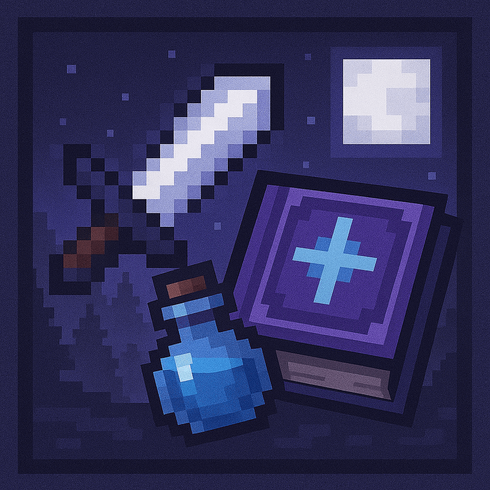
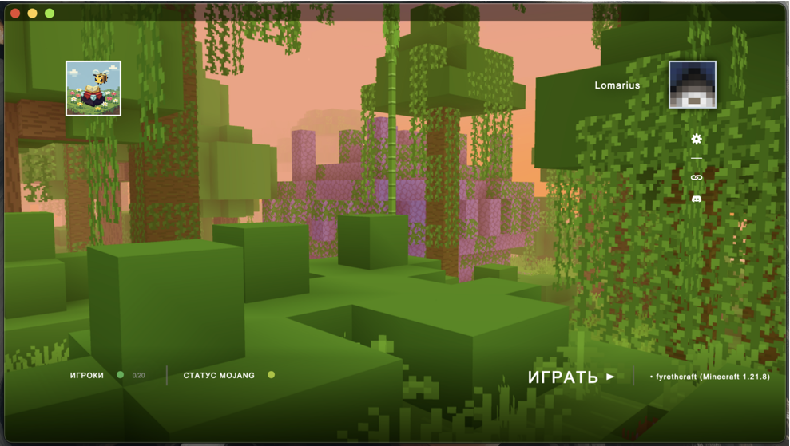

<p align="center"></p>

<h1 align="center">FyrethCraft Launcher</h1>
<h2 align="center"><small>Fork by <a href="https://github.com/dscalzi/HeliosLauncher" target="_blank">Helios Launcher</a></small></h2>

<em><h5 align="center">(formerly Electron Launcher)</h5></em>

<p align="center">Join modded servers without worrying about installing Java, Forge, or other mods. We'll handle that for you.</p>



## Features

* 🔒 Full account management.
  * Add multiple accounts and easily switch between them.
  * [Microsoft (OAuth 2.0)](https://www.microsoft.com/) 
  * [Ely.by](https://ely.by/)
* 🛡️ **Secure Join System.**
  * "Strict join" only from the launcher using a dynamic `join_token`.
  * Integration with external Auth API for secure session validation.
* 📂 Efficient asset management.
  * Receive client updates as soon as we release them.
  * Files are validated before launch. Corrupt or incorrect files will be redownloaded.
* ☕ **Automatic Java validation.**
  * If you have an incompatible version of Java installed, we'll install the right one *for you*.
  * You do not need to have Java installed to run the launcher.
* 📰 News feed natively built into the launcher.
* ⚙️ Intuitive settings management, including a Java control panel.
* Supports all of our servers.
  * Switch between server configurations with ease.
  * View the player count of the selected server.
* Automatic updates. That's right, the launcher updates itself.
*  View the status of Mojang's services.
* 🌍 **Multi-language support.**
  * Interface available in multiple languages including:
    * English
    * Russian
    * Ukrainian
    * Spanish
    * Portuguese
    * German
    * French
    * Japanese
    * Chinese
  * Easy language switching through settings.

This is not an exhaustive list. Download and install the launcher to gauge all it can do!

## Downloads

You can download from [GitHub Releases](https://github.com/VR-nine/FyrethCraft-Launcher/releases)

**Supported Platforms**

If you download from the [Releases](https://github.com/VR-nine/FyrethCraft-Launcher/releases) tab, select the installer for your system.

| Platform | File |
| -------- | ---- |
| Windows x64 | `FyrethCraft-Launcher-setup-VERSION.exe` |
| macOS x64 | `FyrethCraft-Launcher-setup-VERSION-x64.dmg` |
| macOS arm64 | `FyrethCraft-Launcher-setup-VERSION-arm64.dmg` |
| Linux x64 | `FyrethCraft-Launcher-setup-VERSION.AppImage` |

## Console

To open the console, use the following keybind.

```console
ctrl + shift + i
```

Ensure that you have the console tab selected. Do not paste anything into the console unless you are 100% sure of what it will do. Pasting the wrong thing can expose sensitive information.

#### Export Output to a File

If you want to export the console output, simply right click anywhere on the console and click **Save as..**


## Development

This section details the setup of a basic developmentment environment.

### Getting Started

**System Requirements**

* [Node.js][nodejs] v20

---

**Clone and Install Dependencies**

```console
> git clone https://github.com/VR-nine/FyrethCraft-Launcher.git
> cd FyrethCraft-Launcher
> npm install
```

---

**Launch Application**

```console
> npm start
```

---

**Build Installers**

To build for your current platform.

```console
> npm run dist
```

Build for a specific platform.

| Platform    | Command              |
| ----------- | -------------------- |
| Windows x64 | `npm run dist:win`   |
| macOS       | `npm run dist:mac`   |
| Linux x64   | `npm run dist:linux` |

Builds for macOS may not work on Windows/Linux and vice-versa.

**Generation token**
```console
node -e "console.log(require('crypto').randomBytes(32).toString('hex'))"
```
---

### Publish

#### Автоматическая публикация
```
export GH_TOKEN=your_github_token

npm run publish        # Все платформы
npm run publish:win    # Только Windows
npm run publish:mac    # Только macOS
npm run publish:linux  # Только Linux
```

#### Ручная публикация

1. Соберите проект: `npm run dist`
2. Получите release notes для текущей версии: `npm run release-notes`
3. Создайте релиз на GitHub с тегом `v{version}` (например, `v0.1.4`)
4. Скопируйте release notes из вывода команды в описание релиза
5. Загрузите все файлы из папки `dist` в релиз

**Важно:** При ручной публикации обязательно загрузите файлы метаданных (`.yml` файлы) для работы автоматических обновлений.

### Changelog

Все изменения записываются в файл `CHANGELOG.md` в формате [Keep a Changelog](https://keepachangelog.com/).

**Формат:**
```markdown
## [Версия] - ГГГГ-ММ-ДД

### Добавлено
- Новые функции

### Изменено
- Изменения в существующих функциях

### Исправлено
- Исправления багов
```

**Получить release notes для текущей версии:**
```bash
npm run release-notes
```

Этот вывод можно скопировать в описание GitHub релиза при ручной публикации.

### Visual Studio Code

All development of the launcher should be done using [Visual Studio Code][vscode].

Paste the following into `.vscode/launch.json`

```JSON
{
  "version": "0.2.0",
  "configurations": [
    {
      "name": "Debug Main Process",
      "type": "node",
      "request": "launch",
      "cwd": "${workspaceFolder}",
      "program": "${workspaceFolder}/node_modules/electron/cli.js",
      "args" : ["."],
      "outputCapture": "std"
    },
    {
      "name": "Debug Renderer Process",
      "type": "chrome",
      "request": "launch",
      "runtimeExecutable": "${workspaceFolder}/node_modules/.bin/electron",
      "windows": {
        "runtimeExecutable": "${workspaceFolder}/node_modules/.bin/electron.cmd"
      },
      "runtimeArgs": [
        "${workspaceFolder}/.",
        "--remote-debugging-port=9222"
      ],
      "webRoot": "${workspaceFolder}"
    }
  ]
}
```

This adds two debug configurations.

#### Debug Main Process

This allows you to debug Electron's [main process][mainprocess]. You can debug scripts in the [renderer process][rendererprocess] by opening the DevTools Window.

#### Debug Renderer Process

This allows you to debug Electron's [renderer process][rendererprocess]. This requires you to install the [Debugger for Chrome][chromedebugger] extension.

Note that you **cannot** open the DevTools window while using this debug configuration. Chromium only allows one debugger, opening another will crash the program.

---

### Note on Third-Party Usage

Please give credit to the original author and provide a link to the original source. This is free software, please do at least this much.

For instructions on setting up Microsoft Authentication, see https://github.com/dscalzi/HeliosLauncher/blob/master/docs/MicrosoftAuth.md.

---

## Resources

* [Wiki][wiki]
* [Nebula (Create Distribution.json)][nebula]
* [v2 Rewrite Branch (Inactive)][v2branch]

The best way to contact the developers is on Discord.

[](https://discord.gg/zNWUXdt)

---

### See you ingame

[nodejs]: https://nodejs.org/en/ 'Node.js'
[vscode]: https://code.visualstudio.com/ 'Visual Studio Code'
[mainprocess]: https://electronjs.org/docs/tutorial/application-architecture#main-and-renderer-processes 'Main Process'
[rendererprocess]: https://electronjs.org/docs/tutorial/application-architecture#main-and-renderer-processes 'Renderer Process'
[chromedebugger]: https://marketplace.visualstudio.com/items?itemName=msjsdiag.debugger-for-chrome 'Debugger for Chrome'
[discord]: https://discord.gg/7rHYdaAQ 'Discord'
[wiki]: https://github.com/VR-nine/FyrethCraft-Launcher/wiki 'wiki'
[nebula]: https://github.com/dscalzi/Nebula 'dscalzi/Nebula'
